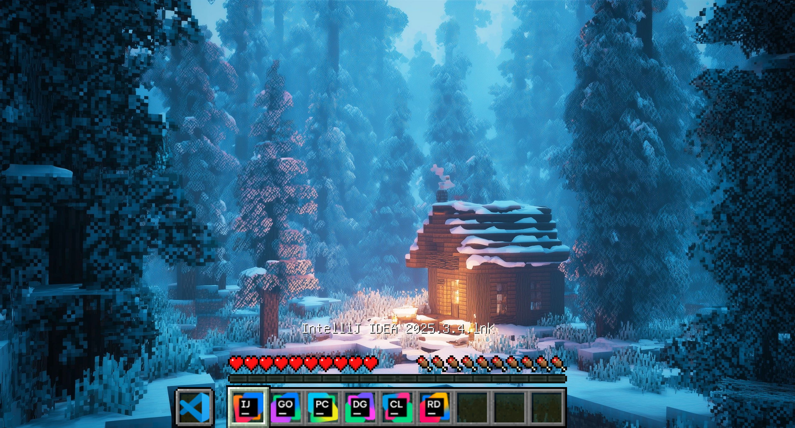
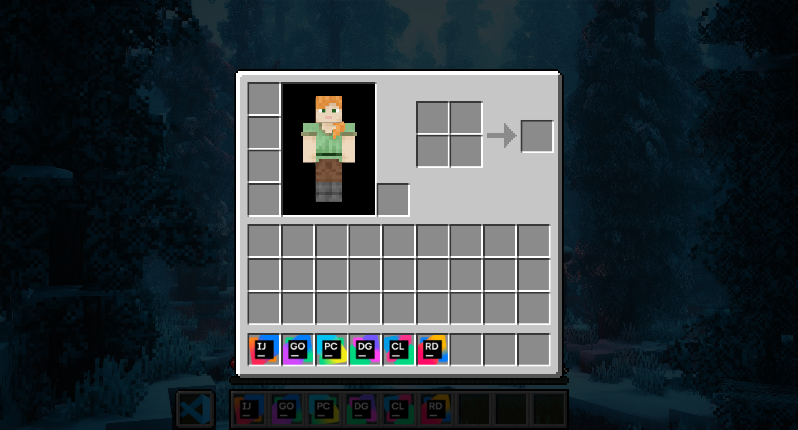
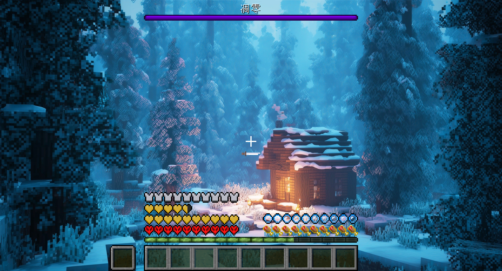
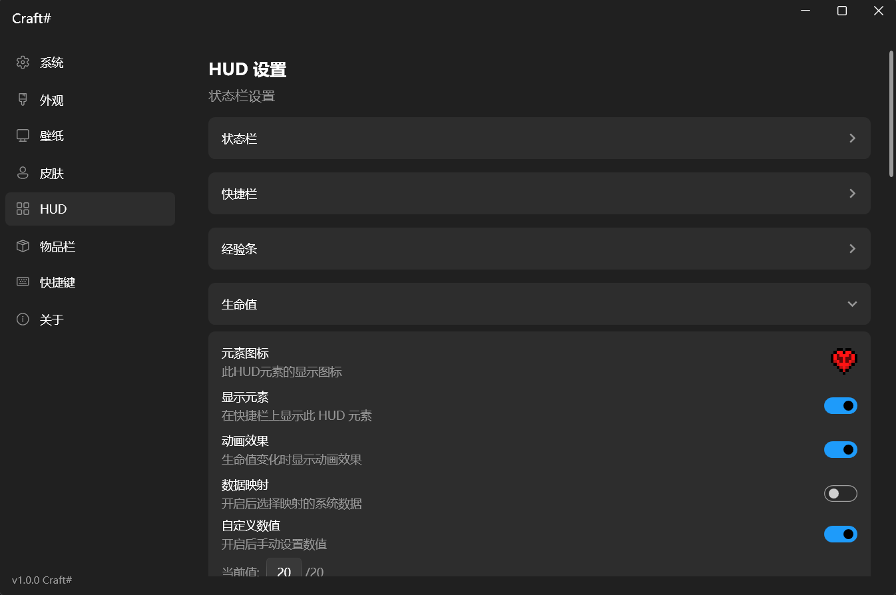
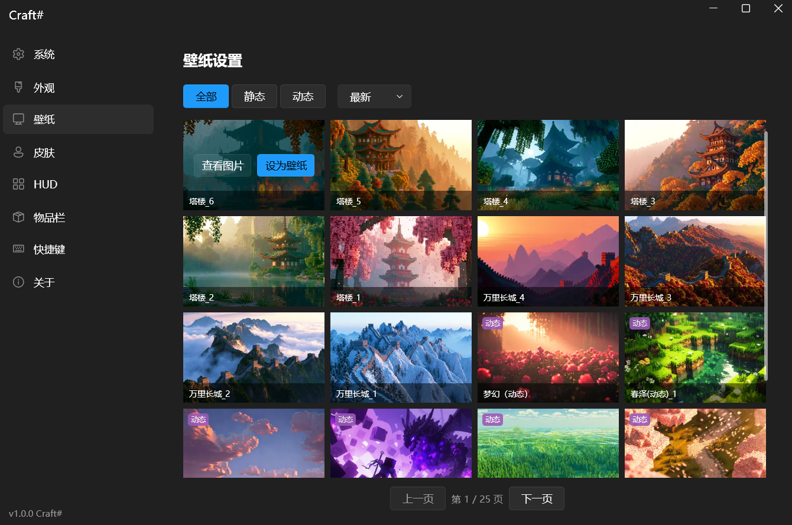
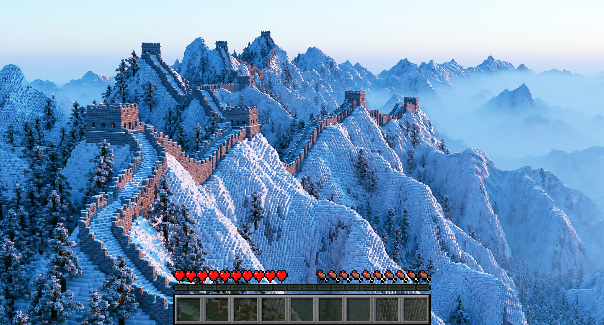
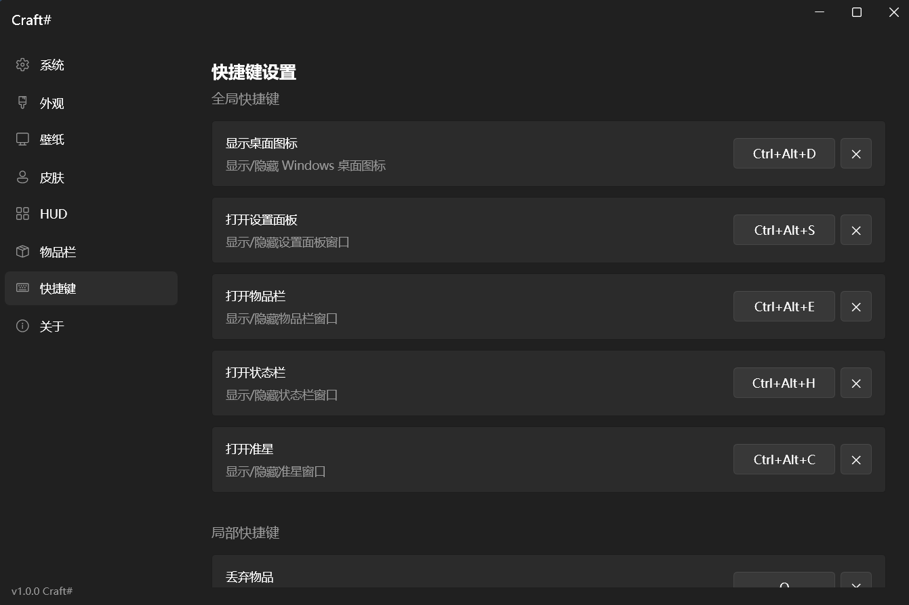

  

<h1 align="center">CraftSharp</h1>

<strong>一款 Minecraft 风格的 Windows 桌面管理及壁纸引擎类应用</strong>

  
  
  
  

  <a href="https://github.com/iFannna/CraftSharp/releases/latest">下载</a> ·
  <a href="https://github.com/iFannna/CraftSharp/issues">反馈</a>

---

## 这是什么

这个创意的灵感来源于 B 站 UP 主 [沫海 CimiMoly](https://github.com/EnderMo) ——在 Windows 桌面上使用 Minecraft HUD 用于管理桌面文件，从他的演示视频来看感觉挺不错的。但实际体验下来，发现在很多方面还差了点意思：Minecraft还原度不高、功能覆盖不够完整、自定义程度有限、部分交互也不太顺手。

于是决定自己动手写一个。CraftSharp 由此诞生 —— 不仅尽可能的还原 Minecraft HUD 的完整体验，还要在可定制性、交互体验、扩展功能等方面做得更深入，真正把 Minecraft 界面带到桌面。

## 亮点

CraftSharp 在 Minecraft HUD 样式高度还原的基础上，还还原了对应的交互细节并延伸处硬件映射与壁纸引擎两大大方向。

- **Minecraft HUD** —— 状态栏、快捷栏、准星、BOSS 血条、物品栏完整还原
- **交互细节** —— 还原了部分 Minecraft 的交互，例如：快捷栏可以通过鼠标滚轮及键盘进行切换选中、按住Shift点击或者长按来对快捷栏物品快速移动至物品栏、Q键丢弃、鼠标中键复制物品等
- **硬件数据映射** —— 将电池电量、内存占用率、CPU、GPU 利用率等硬件数据实时映射到 HUD 元素等，通过样式和动画展现系统状态，一目了然
- **壁纸与皮肤** —— 在线浏览 Minecraft 风格高清精美壁纸一键设置（壁纸来源：[MCBlock](https://cdn.mcblock.top/wallpapers)），并在玩家物品栏中展示 3D 玩家模型，允许切换皮肤，支持自定义上传
- **深度可定制** —— 语言、主题切换、全局热键，每个 HUD 元素都可独立调整样式

## 界面截图

### 状态栏
<picture>
  
</picture>

### 物品栏
<picture>
  
</picture>

### 其他HUD元素
<picture>
  
</picture>

### 调节样式
<picture>
  
</picture>

### 切换皮肤
<picture>
  
</picture>

### 跟换壁纸
壁纸来源：[MCBlock](https://cdn.mcblock.top/wallpapers)

<picture>
  
</picture>

<picture>
  
</picture>

### 快捷键
<picture>
  
</picture>

## 安装

前往 [GitHub Releases](https://github.com/iFannna/CraftSharp/releases/latest) 下载最新版本安装包（`CraftSharp_Setup.exe`），双击运行即可。

仅支持 Windows 10/11，安装包为自包含发布，无需额外安装 .NET Runtime。

## 许可证

CraftSharp 基于 [MIT License](LICENSE) 开源。你可以自由使用、修改和分发。

---

  如果你觉得该项目做的不错可以 <a href="https://github.com/iFannna/CraftSharp">在 GitHub 上点个 Star</a>

